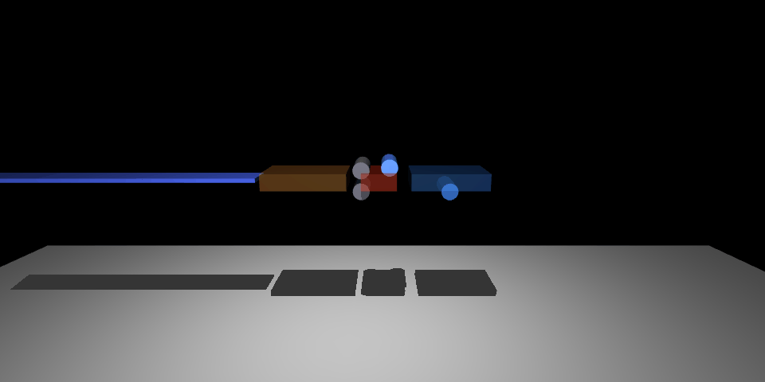
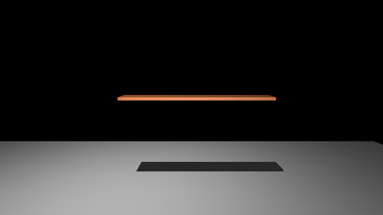

# cnc-acrylic-roller

**A physics-first feasibility study for a CNC machine that heats, rolls, and quenches
flat acrylic strip into arbitrary curves — for sculpture.**

The idea: feed a strip of PMMA through a moving *heat → bend → cool* zone under
computer control, freezing a *varying* curve (ultimately a 3D space curve — curve
+ twist) into the material. This repo doesn't build the machine; it answers
**whether the process is physically possible at all**, and where it breaks.



*MuJoCo thermo-mechanical co-simulation: the strip (tinted blue→red→blue by
temperature) rides a feed carriage through pre-heat → bend roller → chilled set
roller. A programmable curvature `κ(t)` makes a varying-radius curve form at the
bend and hold as it cools.*

---

## Verdict

**Feasible — for slow, one-off, thin-strip sculpture — and the thing that makes or
breaks it is THERMAL THROUGHPUT, not control and not mechanics.**

Three findings drive the whole design:

1. **Mechanically trivial.** At forming temperature the modulus drops ~500× (3 GPa
   cold → ~6 MPa at 155 °C). Bending a 3 mm strip to a 100 mm radius needs a roller
   force of **~0.16 N**. Don't over-build the mechanism.
2. **Control-loop *speed* is a non-issue.** The strip is a slow thermal plant
   (τ ≈ 21 s); a PID sampling at **0.05 Hz** rejects a draft as well as one at 10 Hz.
   The real difficulty is a narrow **25 °C** forming↔scorch window and soak-drift.
3. **Form HOT or don't bother.** Springback collapses above Tg: form at ≥150–155 °C
   and it nearly vanishes *and* stops caring about temperature — which is exactly
   what makes **open-loop** control viable. Form near Tg and ±5 °C of noise wrecks
   the radius (±25 %).

The limiter is that acrylic is a thermal insulator: heating scales as **thickness²**,
so you stay at 2–3 mm and feed at **~0.5 mm/s**. A 600 mm strip ≈ 20 minutes — fine
for sculpture, not for production.

> **Full write-up with all the numbers, the continuous station architecture, roller
> materials, and the honest risk list → [`FEASIBILITY.md`](FEASIBILITY.md).**

The single biggest **unmodeled** risk is **crazing from the quench** — a
residual-stress failure the thermal model can't predict. It needs a physical coupon
test before anything else; the recommendation is to start with strong *chilled air*,
not water.

## The simulations

Everything is parametric — edit constants (or `sim/material.py`) and re-run.

| animation | what it shows |
|---|---|
|  | **Full machine** — feed carriage, temperature-tinted strip, programmable curvature exits as a varying-radius curve. |
|  | **Single-bend forming bench** — heat → bend → cool → release; springback *emerges* from a viscoelastic relaxation ODE, not a script. |
|  | **Hot-zone sag** — a fully-soft cantilever band sagging under gravity, used to find the physical floppy-zone / handling limit (~26 mm). |

Under the hood there are two layers that cross-validate each other:

- **Analytic models** — 1-D transient conduction (implicit FD, Robin BCs), FOPDT
  plant ID + IMC-PID, viscoelastic springback, a continuous three-station feed
  balance, and roller material/stick maps.
- **MuJoCo co-sims** — the strip as a serial hinge-chain beam whose stiffness is
  driven live by `E(T)` and whose rest angle follows a relaxation ODE, so sag,
  forming, and springback **emerge** rather than being scripted. Includes a
  pure-contact bender (`machine_contact.py`) where the strip is formed by *real
  roller contact forces*, not a commanded former.

The two layers agree: the co-sim reproduces the analytic springback to <1 % in the
hot regime, and the all-cold sag matches Euler-Bernoulli self-weight to ~8 %.

## Run it

```bash
make interactive   # LIVE full machine — drag the feed-speed & curvature sliders
make bench         # LIVE single-bend forming bench — heat, bend, cool, watch springback
make machine       # batch full-machine animation  -> sim/out/machine.gif
make sim           # batch sag sweep + forming bench (plots + gifs)
make models        # run all analytic feasibility models -> plots in sim/out/
make help          # everything else
```

Requires `numpy`, `scipy`, `matplotlib`, and `mujoco` (+ `imageio` for the gifs).
The live viewers need a windowed GL backend (`glfw`); batch runs are headless
(`osmesa`). See [`sim/README.md`](sim/README.md) for the per-file breakdown.

## Status & scope

Design-first — **no physical machine has been built.** Material data is
literature-grade, so *trends are solid but absolute numbers are ±2×* (flagged
throughout). Deliberately **not** modeled yet: 3D twist (the actual sculpture goal —
adds a second springback mode and gravity-untwist of the hot zone), machine CAD,
and toolpath software.

**Next slice that de-risks the most:** a physical crazing/springback coupon test —
bend hot scrap at several temperatures and quench methods, look for craze, measure
real springback. That's the one thing the model can't settle.
